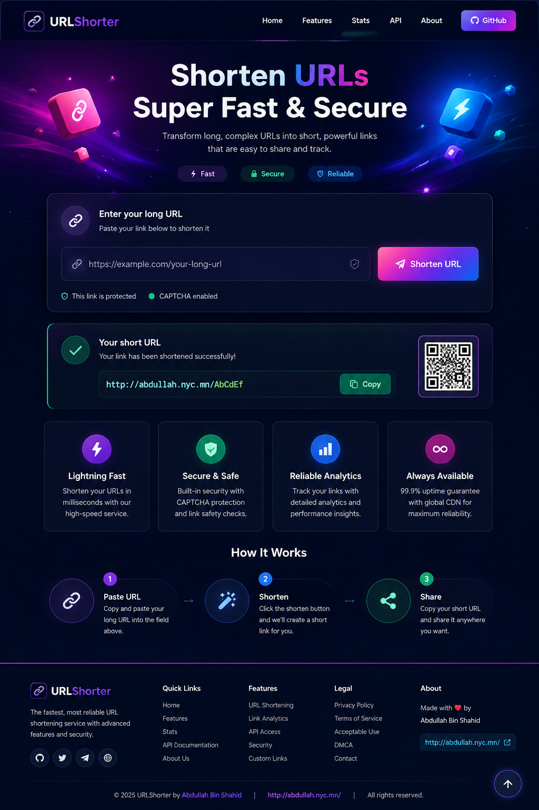
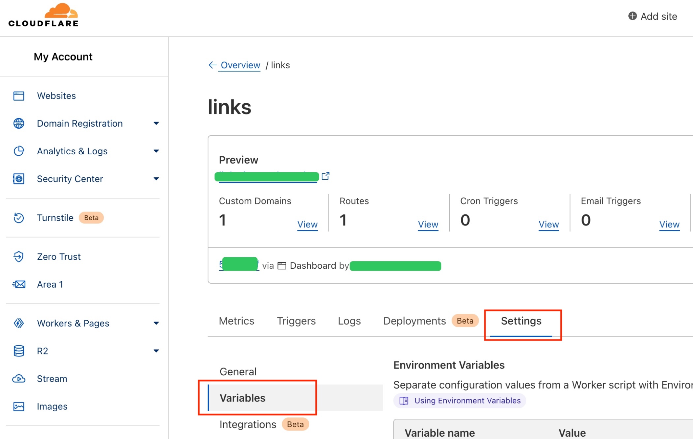
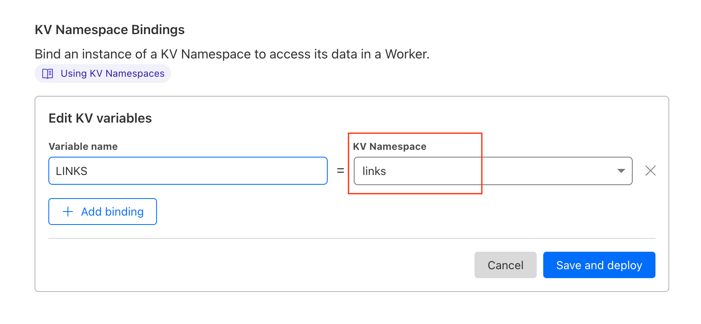

# 🔗 URLShorter

<div align="center">



### ⚡ Fast • 🔒 Secure • 🎨 Modern URL Shortening

A professional, responsive URL shortening service powered by **Cloudflare Workers**.

<br>

<a href="https://go.abdullah.nyc.mn/ANiFZm"><strong>🚀 Open URLShorter</strong></a>
&nbsp;&nbsp;•&nbsp;&nbsp;
<a href="https://go.abdullah.nyc.mn/ANiFZm"><strong>🔗 Try Example</strong></a>

</div>

---

## ✨ Features

- ⚡ **Lightning-fast URL shortening**
- 🔗 Clean, shareable short links
- 📋 **One-click Copy** button for generated URLs
- 📱 Fully responsive on mobile, tablet and desktop
- ☀️ **Light Mode enabled by default**
- 🌙 Beautiful **Dark Mode**
- 🛡️ Optional security/CAPTCHA integration
- 🔐 Optional URL safety checking
- ♻️ Unique short links
- ⏱️ Optional link expiration
- 🌐 CORS support
- 🎨 Modern animated interface
- 🚀 Cloudflare Worker deployment

---

## 🌐 Example Short URL

**https://go.abdullah.nyc.mn/ANiFZm**

<div align="center">

<a href="https://go.abdullah.nyc.mn/ANiFZm"><strong>🚀 Open Example Short URL</strong></a>

</div>

---

## 📸 Website Preview

<div align="center">


</div>

---

# 🚀 Getting Started

## ☁️ Quick Cloudflare Worker Setup

### 1. 📦 Create a Workers KV Namespace

Open **Cloudflare Dashboard → Workers & Pages → KV** and create a new KV namespace.

Choose any name you like. For example:

```text
links
```

📸 Example:



---

### 2. 🔗 Bind the KV Namespace to Your Worker

Open your Worker and go to:

**Settings → Variables → KV Namespace Bindings**

Add a KV binding.

**Variable name:**

```text
LINKS
```

Then select the KV namespace you created in the previous step.

📸 Example:



> ✅ The Worker code expects the KV binding variable to be named `LINKS`.

---

### 3. 📝 Copy the Worker Code

Open the Worker source file in this project and copy the **complete Worker code**.

Then open your Cloudflare Worker and replace the existing code with the copied code.

---

### 4. ⚙️ Configure the Worker

The main settings are inside the `config` object.

Example:

```js
const config = {
  no_ref: "off",
  theme: "theme/captcha",
  cors: "on",
  unique_link: true,
  custom_link: false,
  safe_browsing_api_key: "",
  expiration_ttl: 0,

  captcha: {
    enabled: true,
    require_on_create: true,
    require_on_access: true,
    timeout: 5000,
    fallback_on_error: true,
    max_retries: 2
  }
};
```

### 🔐 CAPTCHA

CAPTCHA is configurable directly from the Worker settings.

You can enable or disable it with:

```js
captcha: {
  enabled: true
}
```

The project does **not** require the old external demo/reference URLs.

---

### 5. 🚀 Save and Deploy

After the KV binding and Worker code are ready:

**Save → Deploy**

Then open your deployed Worker and test URL shortening.

---

# 🧪 How to Use

1. 🌐 Open your deployed URLShorter website.
2. 🔗 Paste a long URL into the input field.
3. 🛡️ Complete the security verification when required.
4. ⚡ Click **Shorten URL**.
5. ✅ Your **Your short URL** result will appear.
6. 📋 Click **Copy** to copy the generated URL.
7. 🚀 Share your short link anywhere.

---

# 🎨 Interface

The modern interface includes:

- 🧭 Professional sticky header
- 🏠 Hero section
- 🔗 URL shortening form
- ✅ **Your short URL** result card
- 📋 Copy button
- ⚡ Feature cards
- 🛠️ How It Works section
- 👤 About section
- ☀️ Light Mode
- 🌙 Dark Mode
- ⬆️ Back-to-top button
- 🧾 Professional footer
- 📱 Responsive mobile layout
- 🎞️ Smooth animations

---

# 🌓 Theme

URLShorter starts in **Light Mode by default**.

Users can switch to **Dark Mode** from the header. The selected theme is stored locally so the preference remains on future visits.

---

# 🔗 Example / Demo Button

Use this example link:

**https://go.abdullah.nyc.mn/ANiFZm**

<div align="center">

<a href="https://go.abdullah.nyc.mn/ANiFZm"><strong>🚀 Open URLShorter</strong></a>

</div>

---

# 👨‍💻 Developer

### Abdullah Bin Shahid

🌐 Personal website:

**http://abdullah.nyc.mn/**

🔗 Example URLShorter link:

**https://go.abdullah.nyc.mn/ANiFZm**

---

# ⚙️ Configuration Options

| Option | Description |
|---|---|
| `no_ref` | Controls referrer hiding |
| `theme` | Homepage theme |
| `cors` | Enables CORS |
| `unique_link` | Reuses the same short URL for the same long URL |
| `custom_link` | Enables custom short URLs |
| `safe_browsing_api_key` | Optional URL safety checking |
| `expiration_ttl` | Optional link expiration in seconds |
| `captcha.enabled` | Enables/disables CAPTCHA |
| `captcha.require_on_create` | CAPTCHA for link creation |
| `captcha.require_on_access` | CAPTCHA for short-link access |
| `captcha.fallback_on_error` | Allows degraded operation if CAPTCHA has an error |

---

# 🛡️ Security Notes

For production use:

- 🔐 Keep API keys private.
- 🧱 Configure Cloudflare Worker bindings correctly.
- 🛡️ Keep security protection enabled when appropriate.
- 🔎 Test redirects before publishing.
- 🚫 Never expose private credentials in frontend code.

---

# 📱 Responsive Support

Designed for:

- 🖥️ Desktop
- 💻 Laptop
- 📱 Mobile
- 📲 Tablet

The layout automatically adapts to different screen sizes.

---

# 📦 Project Structure

```text
URLShorter/
├── index.js
├── README.md
└── docs/
    ├── urlshorter-preview.png
    ├── cloudflare-worker-settings.png
    └── cloudflare-kv-binding.png
```

---

<div align="center">

## 💜 URLShorter

**Fast. Secure. Simple.**

Built by **Abdullah Bin Shahid**

<br>

<a href="https://go.abdullah.nyc.mn/ANiFZm"><strong>🚀 https://go.abdullah.nyc.mn/ANiFZm</strong></a>

</div>
